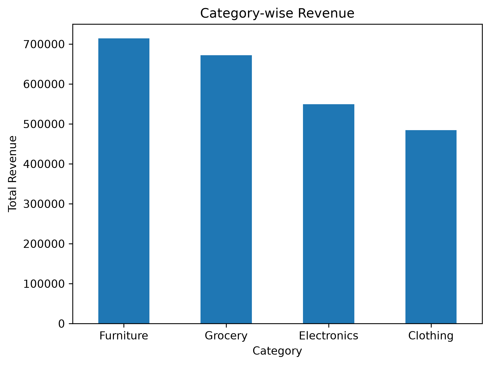
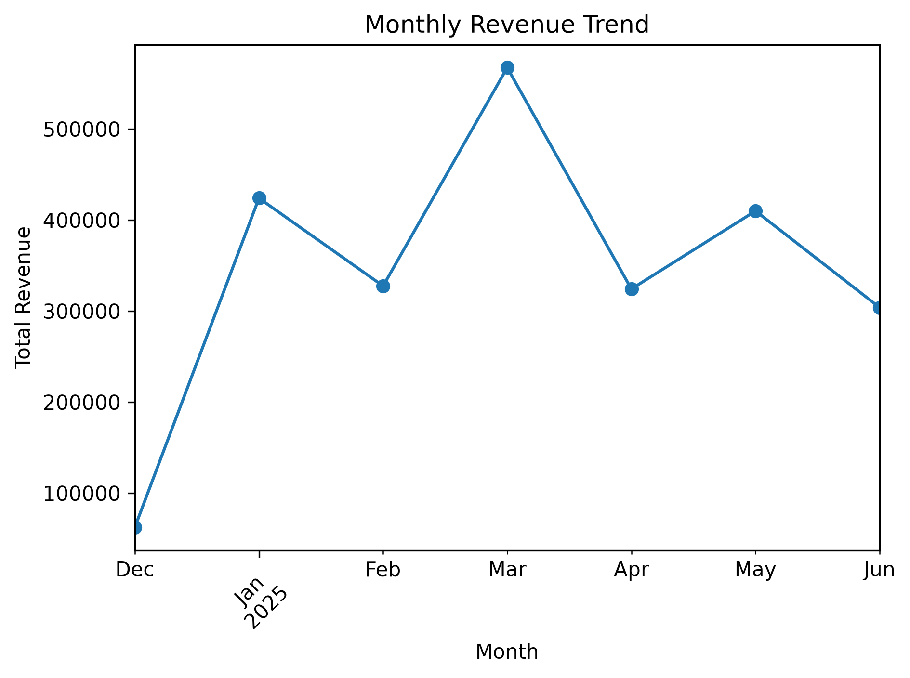
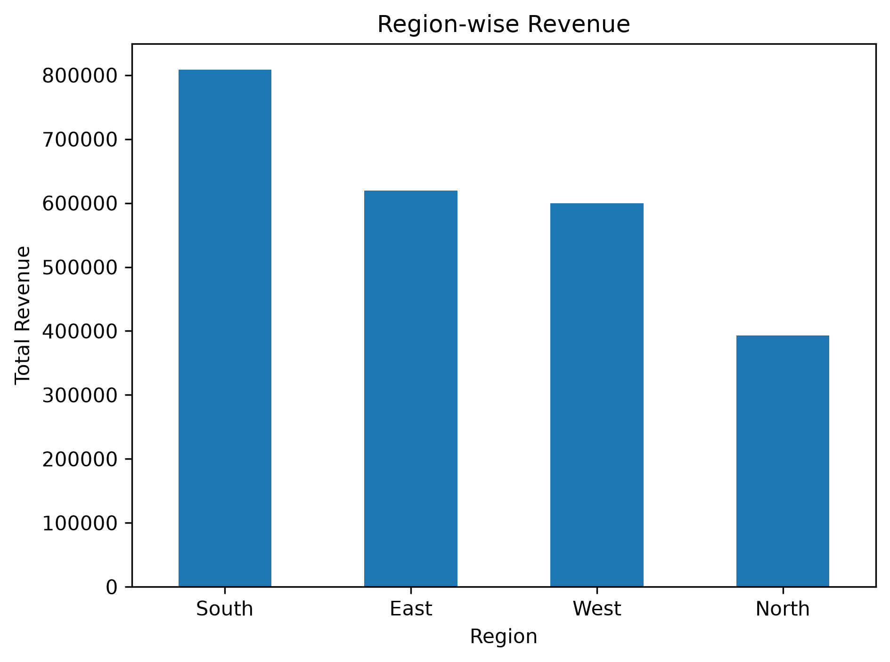
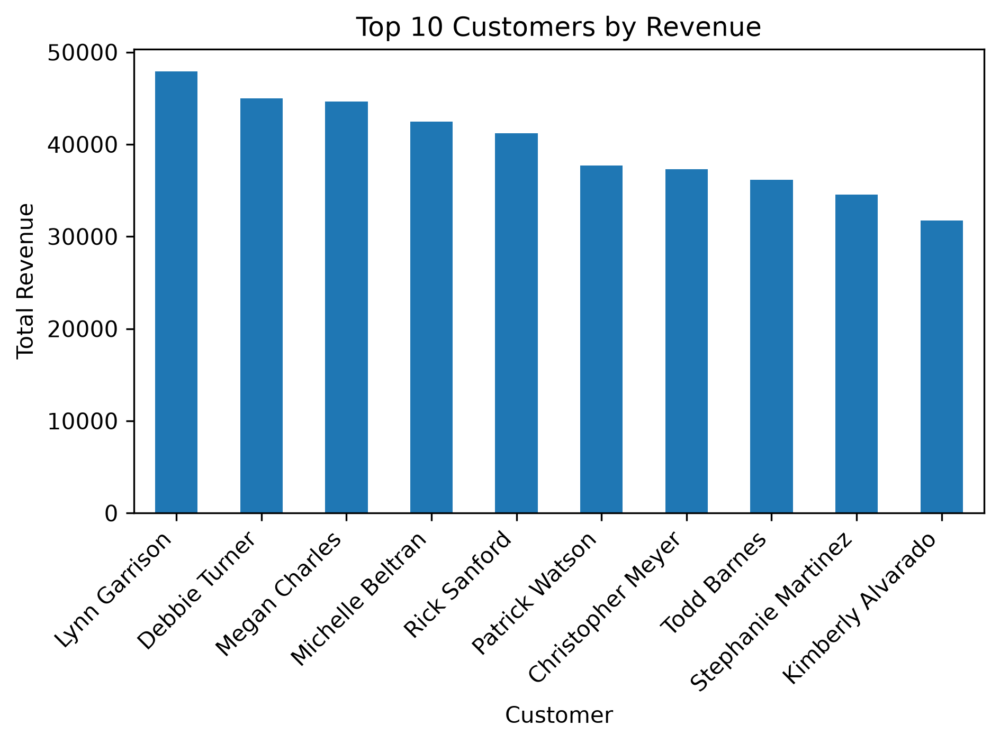
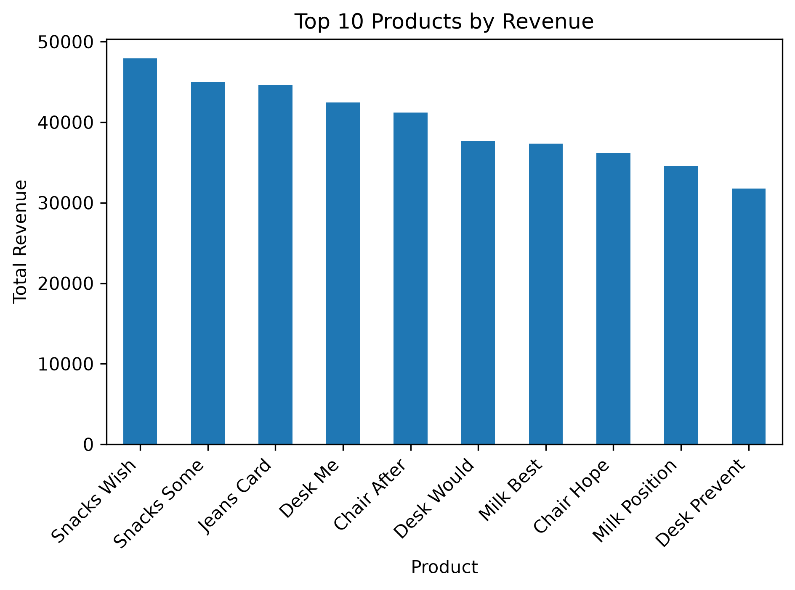

# 📦 E-Commerce Delivery and Revenue Analysis

A comprehensive Python and Machine Learning project designed to analyze e-commerce parcel details, product tracking, regional distribution, and sales revenue trends.

---

## 🚀 Project Overview
This project processes e-commerce data to uncover actionable business insights. It evaluates sales performance across various categories, regions, and months while identifying top-performing products and high-value customers. Visualizations were built using Python data science libraries to clearly communicate trends to stakeholders.

---

## 📊 Key Visualizations & Insights

### 1. Category-wise Revenue
* **Overview:** Evaluates which product categories generate the highest total revenue.
* **Key Finding:** *Furniture* and *Grocery* lead total revenue generation, closely followed by *Electronics* and *Clothing*.


### 2. Monthly Revenue Trend
* **Overview:** Tracks sales performance month-over-month to identify seasonal peaks.
* **Key Finding:** Revenue experiences a significant spike in March, followed by stabilizing trends through the subsequent months.


### 3. Region-wise Revenue
* **Overview:** Breaks down sales distribution geographically across different regions.
* **Key Finding:** The *South* region outperforms others significantly, followed by *East* and *West*.


### 4. Top 10 Customers by Revenue
* **Overview:** Highlights the highest-value customers driving repeat purchases.
* **Key Finding:** Customers like *Lynn Garrison* and *Debbie Turner* lead the top tier of customer lifetime value.


### 5. Top 10 Products by Revenue
* **Overview:** Identifies the best-selling products contributing most to overall sales.
* **Key Finding:** Products like *Snacks Wish*, *Snacks Some*, and *Jeans Card* dominate the top revenue spots.


---

## 🛠️ Tech Stack & Libraries
* **Language:** Python
* **Data Manipulation & Analysis:** Pandas, NumPy
* **Data Visualization:** Matplotlib, Seaborn
* **Machine Learning:** Scikit-Learn

---

## ⚙️ How to Run Locally

1. **Clone the repository:**
   ```bash
   git clone [https://github.com/SudarshanJha75/ecommerce-delivery-and-revenue-analysis.git](https://github.com/SudarshanJha75/ecommerce-delivery-and-revenue-analysis.git)
   cd ecommerce-delivery-and-revenue-analysis
